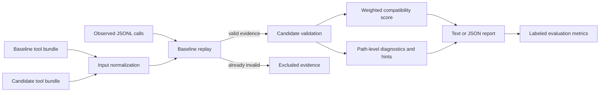

# AgentCompat

[](https://github.com/armanzareian/agentcompat/actions/workflows/ci.yml)
[](LICENSE)
[](pyproject.toml)

Trace-driven compatibility testing for evolving LLM tool schemas.

Agent tool definitions change as APIs mature. A schema diff can show that a field became
required, an enum narrowed, or a tool disappeared, but it cannot tell you which historical
agent calls will actually break. AgentCompat replays observed tool-call arguments against both
the baseline and candidate schemas, excludes evidence that was already invalid, and calculates
a usage-weighted compatibility score with concrete repair hints.

It runs offline, requires no model or API key, and produces deterministic text or JSON suitable
for local development and CI.

## Why AgentCompat

- **Observed impact, not only structural change:** score the calls agents actually emitted.
- **Honest denominator:** baseline-invalid traces are reported and excluded from compatibility.
- **Usage weighting:** frequent or business-critical traces can carry more weight.
- **Actionable failures:** each breakage includes a JSON path, reason code, and migration hint.
- **Measurable evaluation:** labeled suites report precision, recall, F1, and root-cause accuracy.
- **Provider-neutral input:** normalize MCP-style and OpenAI-style tool bundles.

AgentCompat does not claim to replace a complete JSON Schema implementation. Version 0.1
implements the common validation subset used by function tools: primitive and container types,
properties, required fields, closed objects, enums, constants, numeric and length bounds,
array items, and `allOf`/`anyOf`/`oneOf`. Unsupported validation keywords are outside the
current score and are scheduled for explicit coverage reporting in the next milestone.

## Quickstart

Run directly from a checkout with no runtime dependencies:

```bash
git clone https://github.com/armanzareian/agentcompat.git
cd agentcompat
PYTHONPATH=src python3 -m agentcompat check \
  --baseline examples/order-api/baseline.json \
  --candidate examples/order-api/candidate.json \
  --traces examples/order-api/traces.jsonl \
  --fail-under 50
```

The included example scores `53.85/100`, identifies four candidate breakages, and excludes one
baseline-invalid trace. Raise `--fail-under` to enforce your release policy.

For an installed CLI:

```bash
python3 -m venv .venv
source .venv/bin/activate
python -m pip install -e .
agentcompat --version
```

Run the labeled evaluation:

```bash
agentcompat eval --suite examples/order-api/suite.json
```

## Inputs

Tool bundles may use MCP-style `inputSchema`:

```json
{
  "tools": [
    {
      "name": "search_orders",
      "inputSchema": {
        "type": "object",
        "properties": {"status": {"type": "string"}},
        "required": ["status"]
      }
    }
  ]
}
```

OpenAI-style `function.parameters` is also accepted. Traces are JSON Lines:

```json
{"trace_id":"run-42","tool":"search_orders","arguments":{"status":"open"},"weight":3}
```

`weight` defaults to `1.0` and must be positive. Inputs are capped at 10 MiB per file and
10,000 traces by default. AgentCompat performs no network requests and never executes trace
content.

## Output

```text
AgentCompat compatibility report
Score: 53.85/100
Calls: 2 passed, 4 broken, 1 excluded
Observed weight: 7/13 compatible
```

Use `--format json` for CI systems and downstream analysis. Exit code `1` means the score is
below `--fail-under`; malformed or unsafe input limits return `2`.

## Architecture



The implementation is split into focused modules for input normalization, schema validation,
replay analysis, evaluation, and presentation. See [Architecture](docs/architecture.md) for
contracts and extension points.

## Development

```bash
make test
make quality
make demo
make eval
```

The full development environment adds Ruff, mypy, pytest, and coverage:

```bash
python -m pip install -e ".[dev]"
ruff check .
ruff format --check .
mypy
pytest --cov
```

## Project scope

This repository is intentionally bounded to one focused week: a working vertical slice on day
one, followed by six independently testable increments covering standards, explanation,
adapters, CI, scale, and release hardening. It excludes a hosted control plane, live telemetry
service, model inference, and web UI.

## Contributing

Read [CONTRIBUTING.md](CONTRIBUTING.md) before opening a pull request. Security issues should
follow [SECURITY.md](SECURITY.md) rather than the public issue tracker.

## License

Apache License 2.0. See [LICENSE](LICENSE).
