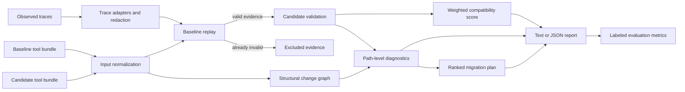

# AgentCompat

[](https://github.com/armanzareian/agentcompat/actions/workflows/ci.yml)
[](LICENSE)
[](pyproject.toml)

Trace-driven compatibility testing for evolving LLM tool schemas.

Agent tool definitions change as APIs mature. A schema diff can show that a field became
required, an enum narrowed, or a tool disappeared, but it cannot tell you which historical
agent calls will actually break. AgentCompat replays observed tool-call arguments against both
the baseline and candidate schemas, excludes evidence that was already invalid, and calculates
a usage-weighted compatibility score with concrete repair hints.

It runs offline, requires no model or API key, and produces deterministic text or JSON suitable
for local development and CI.

## Why AgentCompat

- **Observed impact, not only structural change:** score the calls agents actually emitted.
- **Honest denominator:** baseline-invalid traces are reported and excluded from compatibility.
- **Usage weighting:** frequent or business-critical traces can carry more weight.
- **Actionable failures:** each breakage includes a JSON path, reason code, and migration hint.
- **Causal migration plan:** failures link to stable structural change IDs and roll up into
  weighted, deduplicated migration work.
- **Trace adapters with redaction:** read common OpenAI, Anthropic, MCP, and LangChain tool-call
  records while scrubbing configured fields before replay.
- **Seeded sampled replay:** score deterministic weighted samples when trace populations are too
  large for exact local review.
- **Measurable evaluation:** labeled suites report precision, recall, F1, and root-cause accuracy.
- **Provider-neutral input:** normalize MCP-style and OpenAI-style tool bundles.

AgentCompat does not claim to replace a complete JSON Schema implementation. It implements a
tested subset used by function tools, resolves sandboxed local references, and refuses to score
schemas containing unsupported semantics. See the [JSON Schema support matrix](docs/schema-support.md)
for the exact keyword and format inventory.

## Quickstart

Run directly from a checkout with no runtime dependencies:

```bash
git clone https://github.com/armanzareian/agentcompat.git
cd agentcompat
PYTHONPATH=src python3 -m agentcompat check \
  --baseline examples/order-api/baseline.json \
  --candidate examples/order-api/candidate.json \
  --traces examples/order-api/traces.jsonl \
  --fail-under 50
```

The included example scores `53.85/100`, identifies four candidate breakages, and excludes one
baseline-invalid trace. Raise `--fail-under` to enforce your release policy.

For an installed CLI:

```bash
python3 -m venv .venv
source .venv/bin/activate
python -m pip install -e .
agentcompat --version
```

Run the labeled evaluation:

```bash
agentcompat eval --suite examples/order-api/suite.json
```

Audit a tool bundle before replay:

```bash
agentcompat audit --schema examples/order-api/candidate.json
```

The audit reports every unsupported keyword with its schema path. `check` performs the same
preflight automatically and returns exit code `2` instead of producing a misleading score.

## Inputs

Tool bundles may use MCP-style `inputSchema`:

```json
{
  "tools": [
    {
      "name": "search_orders",
      "inputSchema": {
        "type": "object",
        "properties": {"status": {"type": "string"}},
        "required": ["status"]
      }
    }
  ]
}
```

OpenAI-style `function.parameters` is also accepted. Traces are JSON Lines:

```json
{"trace_id":"run-42","tool":"search_orders","arguments":{"status":"open"},"weight":3}
```

`weight` defaults to `1.0` and must be positive. Inputs are capped at 10 MiB per file and
10,000 traces by default. Trace records are streamed into replay, so adapter parsing and
redaction do not require building a separate in-memory list before analysis. Local `$ref` files
must remain beneath the bundle directory; traversal, remote references, missing pointers, and
cycles are rejected. AgentCompat performs no network requests and never executes trace content.

For large trace populations, pass `--sample-size` to score a deterministic weighted stratified
sample instead of every parsed trace:

```bash
agentcompat check \
  --baseline examples/order-api/baseline.json \
  --candidate examples/order-api/candidate.json \
  --traces examples/order-api/traces.jsonl \
  --sample-size 1000 \
  --sample-seed 17 \
  --format json
```

Sampling allocates records across tool strata by observed trace weight, selects within each
tool using seeded weighted priorities, and preserves the original order of selected traces in
the report. JSON output includes the population, selected count, seed, sampled weight, and
per-tool sampling strata so sampled scores can be reproduced and audited.

Trace files can also use provider-shaped records:

```bash
agentcompat check \
  --baseline examples/order-api/baseline.json \
  --candidate examples/order-api/candidate.json \
  --traces examples/order-api/openai-traces.jsonl \
  --trace-format openai \
  --redact-path '$.customer_id' \
  --redact-key-pattern 'token|api[_-]?key' \
  --fail-under 50
```

Supported trace formats are:

- `canonical`: AgentCompat JSONL with `trace_id`, `tool`, `arguments`, and optional `weight`.
- `openai`: Responses API `function_call` items and Chat Completions `message.tool_calls`.
- `anthropic`: `tool_use` content blocks and matching content-block stream records.
- `mcp`: JSON-RPC `tools/call` requests, including request-wrapped transcript rows.
- `langchain`: `on_tool_start` events with object-valued `data.input`.

`--redact-path` matches exact argument JSON paths such as `$.customer.email` or
`$.rows[*].secret`. `--redact-key-pattern` applies a regular expression to argument object keys
at any depth. Redaction happens before canonical `ToolCall` objects are returned to replay, so
validation reports can only include the replacement value. Adapter errors identify the source
line and field without echoing malformed argument payloads. Non-tool rows in provider stream
logs are skipped; a file with no tool calls is rejected.

## Output

```text
AgentCompat compatibility report
Score: 53.85/100
Calls: 2 passed, 4 broken, 1 excluded
Observed weight: 7/13 compatible

Tool risk
- search_orders: 45.45/100 (risk weight 6; 4 broken, 1 excluded)

Migration plan
1. [required_added] search_orders $.customer_id (weight 2; 1 trace)
2. [enum_narrowed] search_orders $.status (weight 2; 1 trace)
```

Each broken issue includes the `change_id` that caused it. The plan groups repeated failures by
change, counts each affected trace weight once, and sorts by affected weight, trace count, then
stable structural keys. The `tools` JSON array gives per-tool score, call counts, compatible
weight, incompatible eligible weight, and excluded baseline-invalid weight. Sampled runs also
include a top-level `sampling` object with population and stratum metadata. Use `--format json`
for the complete `changes`, per-issue `change_ids`, `tools`, `sampling`, and `migration_plan`
arrays. See [Change attribution](docs/change-attribution.md) for the machine-readable contract.

Exit code `1` means the score is below `--fail-under`; malformed or unsafe input limits return
`2`.

## GitHub Actions

Use the reusable action to enforce the same compatibility policy in CI:

```yaml
permissions:
  contents: read

steps:
  - uses: actions/checkout@v4
    with:
      persist-credentials: false

  - uses: armanzareian/agentcompat@main
    with:
      config: .agentcompat.json
```

The action writes a pull-request job summary with links to affected trace IDs, exposes score and
call-count outputs, and generates JSON plus SARIF reports. See the
[GitHub Action guide](docs/github-action.md) for policy configuration, changed-schema discovery,
read-only workflow permissions, and fixture outcomes.

## Architecture



The implementation is split into focused modules for input normalization, schema validation,
replay analysis, evaluation, and presentation. See [Architecture](docs/architecture.md) for
contracts and extension points.

## Development

```bash
make test
make quality
make demo
make eval
```

The full development environment adds Ruff, mypy, pytest, and coverage:

```bash
python -m pip install -e ".[dev]"
ruff check .
ruff format --check .
mypy
pytest --cov
```

## Project scope

This repository is intentionally bounded to one focused week: a working vertical slice on day
one, followed by six independently testable increments covering standards, explanation,
adapters, CI, scale, and release hardening. It excludes a hosted control plane, live telemetry
service, model inference, and web UI.

## Contributing

Read [CONTRIBUTING.md](CONTRIBUTING.md) before opening a pull request. Security issues should
follow [SECURITY.md](SECURITY.md) rather than the public issue tracker.

## License

Apache License 2.0. See [LICENSE](LICENSE).
